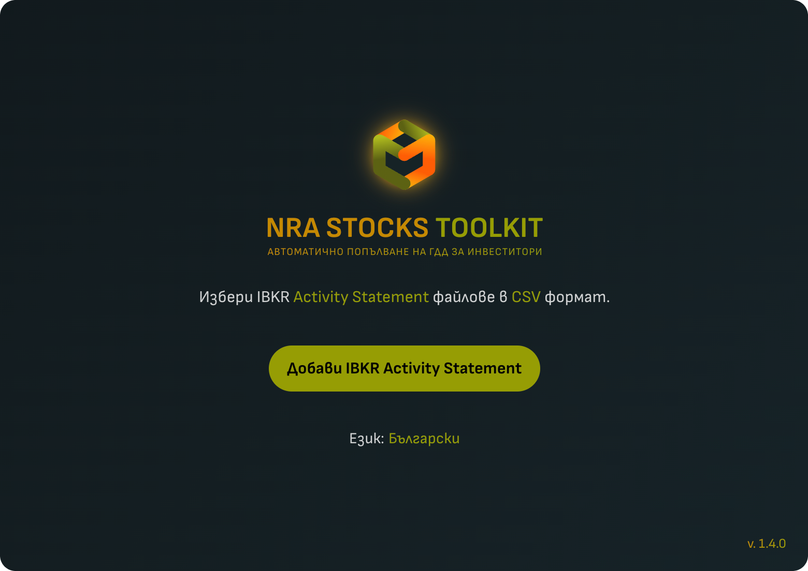
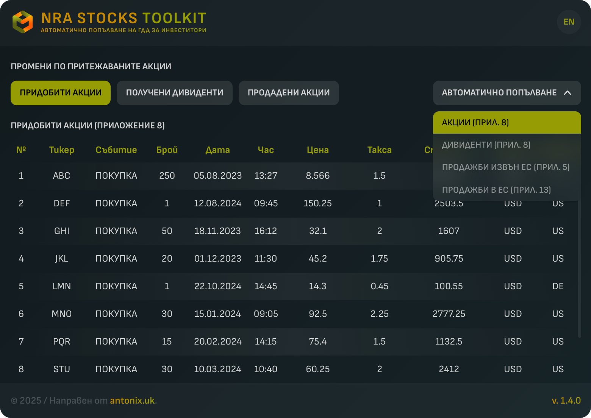
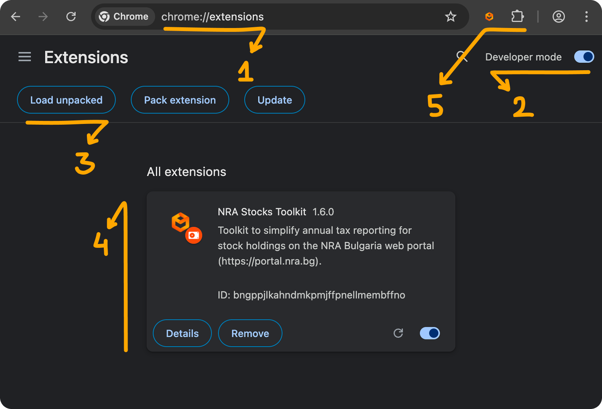
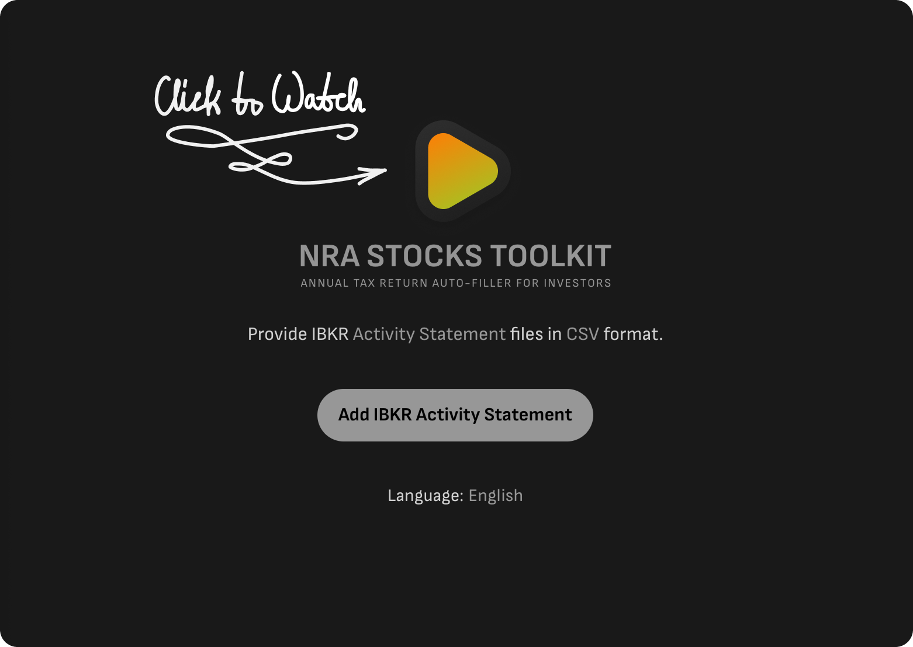

# NRA Stocks Toolkit - Автоматично попълване на Годишна Данъчна Декларация (ГДД) за инвеститори от България

**For the Bulgarian version of this document, click [here](README.md).**

>**Уверете се, че винаги използвате най-новата версия, която в момента е v. 1.4.0.**

Този браузър екстеншън има за цел да улесни попълването на приложенията от ГДД, отнасящи се до притежаване, продажба и дивиденти от акции, в портала на Националната Агенция за Приходите (НАП) в България (https://portal.nra.bg). То помага на потребителите да спестят време, като предварително попълва формуляри и прави взаимодействието с портала по-бързо и ефективно.

За кратка демонстрация виж видеото: [тук](https://youtu.be/JjMxRMxLQno).

> **Забележка: Скрийншотите показват нереални, автоматично генерирани данни, използвани единствено за демонстрация на интерфейса.**

## Функционалност
- Автоматично попълване на Приложение 8, Част I от ГДД: Информация за притежаваните към 31 декември на данъчната година акции и дялови участия в дружества в чужбина.
-	Автоматично попълване на Приложение 8, Част III от ГДД: Определяне на дължимия окончателен данък по чл. 38 от ЗДДФЛ за доходи от източници в чужбина на местни физически лица.
-	Автоматично попълване на Приложение 5, Част I, Таблица III от ГДД: Доходи от продажба или замяна на акции, дялове, компенсаторни инструменти, инвестиционни бонове и други финансови активи.
- Автоматично попълване на Приложение 13, Част II, код 508: Продажба на акции в рамките на ЕС.

## Поддържани платформи за търговия с акции
  ### Interactive Brokers (IBKR) – изисква "Activity Statement" във формат CSV.
  Поддържани дейности:
  - Покупка
  - Продажба
  - Разделяне (split) на акции (Забележка: reverse split не се поддържа)

  Понастоящем някои корпоративни действия като spin-off и reverse split не се поддържат.

> Ако желаете да добавя поддръжка за други популярни платформи за търговия с акции, не се колебайте да ми пишете на [antonix.uk@gmail.com](mailto:antonix.uk@gmail.com) или да започнете [дискусия](https://github.com/antonfuchedzhiev/nra-stocks-toolkit/discussions) в GitHub. За да стане това възможно, ще ми е необходим примерен отчет от съответната платформа - най-добре във формат CSV, без лична информация и с примерни (нереални) данни. Като алтернатива можете сами да напишете адаптер или конвертор, който да съответства на структурата на IBKR Activity Statement, използвайки предоставения тестов отчет: [FAKE_U921264901_2023_2024.csv](resources/FAKE_U921264901_2023_2024.csv).

## Поддържани езици
- Английски
- Български

## Поддържани браузъри
- Google Chrome
- Microsoft Edge
- Brave

## Как да добавите екстеншъна към браузъра
Download the unpacked extension as a ZIP file from [here](https://github.com/antonfuchedzhiev/nra-stocks-toolkit/archive/refs/heads/main.zip), or clone the repository using your preferred Git client.

Изтеглете екстеншъна като ZIP файл от [тук](https://github.com/antonfuchedzhiev/nra-stocks-toolkit/archive/refs/heads/main.zip) или клонирайте хранилището чрез предпочитания от вас Git клиент.

1. Въведете в адресната лента: "chrome://extensions" и натиснете Enter, за да отворите страницата "My extensions".
- Google Chrome - отворете "chrome://extensions"
- Microsoft Edge - отворете edge://extensions
- Brave - отворете "brave://extensions"
2. Включете "Developer mode" от бутона в горния десен ъгъл. Ще се появят три нови бутона.
3. Натиснете "Load unpacked", и изберете папката, в която сте изтеглили разширението.
4. "NRA Stocks Toolkit" ще се появи в списъка с екстеншъни.
5. За бърз достъп, "закачете" 😂 екстеншъна в лентата с инструменти на браузъра.

## Как се използва

За кратка демонстрация виж видеото: [тук](https://youtu.be/JjMxRMxLQno).

### Изтегляне на извлечения от IBKR
  1. Влезте в акаунта си в IBKR и отидете на "Performance & Reports" > "Statements".
  2. Изберете предпочитания от вас акаунт, след което от "Default Statements" > "Activity".
  3. Задайте "Period" to "Annual" и изберете най-ранната година от списъка. Оставете "Language" на Английски.
  4. В "Select на Format/Action" изтеглете CSV файла.
  5. Повторете горните стъпки за всеки акаунт и година, за която подавате данъчна декларация.

### Добавяне на файлове към NRA Stocks Toolkit
  1. Отворете портала на НАП (https://portal.nra.bg) и отидете на:
  - Приложение 8 за придобити акции и получени дивиденти
  - Приложение 5 за продадени акции от борси извън ЕС
  - Приложение 13 за продадени акции от борси в ЕС
  2. Отворете "NRA Stocks Toolkit" екстеншъна от списъка с разширения в браузъра.
  3. Натиснете "Добави IBKR Activity Statement" и изберете всички изтеглени CSV файлове.

### Преглед и попълване на придобитите акции
  1. Ще се покаже таблицата "Придобити акции", обобщаваща събитията на придобиване на акции. **Продажбите се приспадат по метода FIFO (First In, First Out) и не се показват в таблицата. Затова за максимална точност е необходима пълна история на придобити/продадени акции до данъчната година.**
  2. Изберете "Акции (Прил. 8)" от менюто "Автоматично попълване" за да попълните Приложение 8, Част I в портала на НАП. Валутните курсове се взимат от сайта на НАП.
  3. След като приключи автоматичното попълване, проверете данните преди да подадете формуляра.

### Преглед и попълване на дивиденти
  1. Изберете таблицата "Получени дивиденти" за да прегледате детайлите. Можете да филтрирате по година, за да съответства на данъчния период.
  2. Натиснете "Дивиденти (Прил. 8)" от менюто "Автоматично попълване" за да попълните Приложение 8, Част III. Валутните курсове се взимат от официалната услуга на НАП въз основа на датата на изплащане на дивидента. Валутните курсове се взимат от сайта на НАП.
  3. След като приключи автоматичното попълване, проверете данните преди да подадете формуляра.

### Прегледайте и попълване на продажби от борси извън ЕС
  1. Изберете таблицата "Продадени акции". Можете да филтрирате по година, за да съответства на данъчния период, след което можете да прегледате данните.
  2. Натиснете "Продажби извън EС (Прил. 5)" от менюто "Автоматично попълване" за да попълните автоматично Приложение 5, Част I, Таблица II. Валутните курсове се взимат от официалната услуга на НАП въз основа на датата на продажба. Валутните курсове се взимат от сайта на НАП.
  3. След приключване на автоматичното попълване, проверете данните преди да подадете формуляра.

### Прегледайте и попълване на продажби от борси в ЕС
  1. Ако видите редове, оцветени в синьо в таблицата "Продадени акции", това означава, че трябва да ги попълните в Приложение 13. За целта преминете към тази секция на сайта на НАП.
  2. Изберете бутон "Продажби в ЕС (Прил. 13)" от менюто "Автоматично попълване" за да попълните автоматично Приложение 13, Част II, Код 508. Валутните курсове се взимат от официалната услуга на НАП въз основа на датата на продажба. Валутните курсове се взимат от сайта на НАП.
  3. След приключване на автоматичното попълване, проверете данните преди да подадете формуляра.

## Официално разпространение и политика за поверителност
  - Този екстеншън не събира, съхранява или споделя лични данни – всичко се обработва локално на вашето устройство.
  - Единствената външна заявка е към услугата на НАП за валутни курсове, като се изпраща само датата на придобиване, за да се изчисли обменният курс. Не се предава друга информация.
  - Официален източник: Този екстеншън е наличен енствено в следното GitHub хранилище – [https://github.com/antonfuchedzhiev/nra-stocks-toolkit](https://github.com/antonfuchedzhiev/nra-stocks-toolkit). Всички други места, откъдето сте изтеглили екстеншъна, могат да представляват риск за сигурността.

## Проблеми и дискусии
🛠️ За проблеми: [https://github.com/antonfuchedzhiev/nra-stocks-toolkit/issues](https://github.com/antonfuchedzhiev/nra-stocks-toolkit/issues)

💬 За дискусии: [https://github.com/antonfuchedzhiev/nra-stocks-toolkit/discussions](https://github.com/antonfuchedzhiev/nra-stocks-toolkit/discussions)

## НАП ресурси

### Списък със спогодби
Държави, с които България има Спогодба за избягване на двойното данъчно облагане (СИДДО) -
https://nra.bg/wps/portal/nra/mezhdunarodni-deinosti/siddo/spisak-sas-spogodbi

### Методи за избягване на двойното данъчно облагане
Методи за премахване на двойното данъчно облагане, съгласно СИДДО за печалбите и доходите на български местни лица в чужбина - https://nra.bg/wps/portal/nra/documents/hiddenfloder1/3fd47b64-2f87-4ee4-8cba-ed43be5ffd6b

## Промени
Кликнете [тук](CHANGELOG.md), за да видите последните актуализации и промени.
