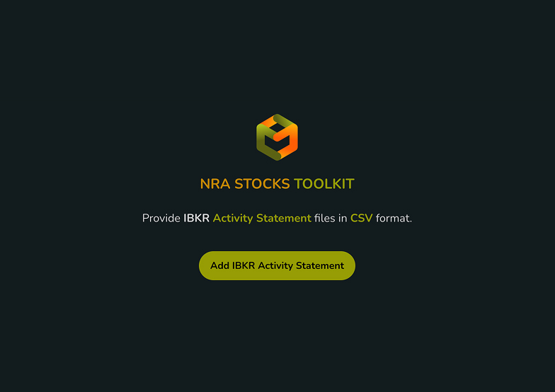
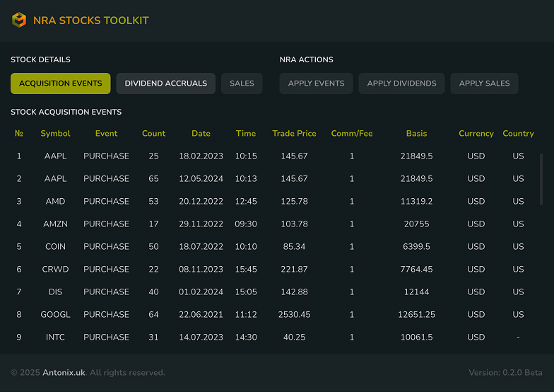
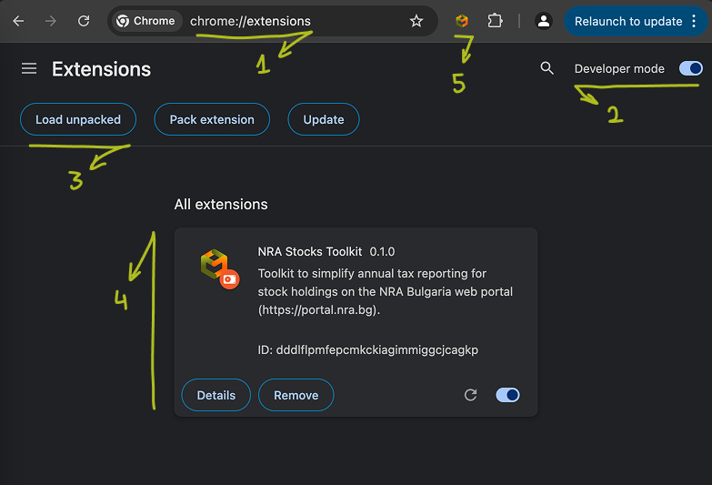

# NRA Stocks Toolkit
The purpose of this Chrome extension is to simplify annual tax reporting for stock holdings on the National Revenue Agency (NRA) portal in Bulgaria (https://portal.nra.bg). It helps users save time by pre-filling forms and making interactions with the portal faster and more efficient.

`Note:` The previous screenshot shows fake auto-generated statement details, used solely for displaying the interface. So, please don't judge the calculations based on it.

## Who is this tool for?
Investors in Bulgaria looking for a faster, more efficient way to manage their stock tax reporting.

## Features
- Auto-fills Annex 8, Part I: Reports stocks and company shares held abroad as of December 31 of the tax year (stocks only).
-	Auto-fills Annex 8, Part III: Determines the final tax due under Article 38 of the Personal Income Tax Act (PITA) for income from foreign sources of resident individuals.

## Supported Brokers
  - Interactive Brokers (IBKR) – Requires an Activity Statement in CSV format.

## How to add extension to your Chrome Browser

Download the unpacked extension from [https://github.com/antonfuchedzhiev/nra-stocks-toolkit](https://github.com/antonfuchedzhiev/nra-stocks-toolkit).

1. In the Chrome address bar, type `chrome://extensions` and press Enter to open the `My extensions` page.
2. Enable `Developer mode` using the toggle in the top-right corner. Three new buttons will appear.
3. Click `Load unpacked`, then select the folder where you downloaded the extension.
4. `NRA Stock Toolkit` will now appear in your extensions list.
5. To access it easily, pin the extension to your browser's toolbar.

## How to Use
1. Download IBKR Statements:
  - Log in to your IBKR account and navigate to `Performance & Reports` > `Statements`.
  - Select your preferred account, then from `Default Statements` choose `Activity`.
  - Set `Period` to `Annual` and choose the earliest year from the list. Keep `Language` set to English.
  - In `Select a Format/Action` download the CSV file.
  - Repeat for each account and year you're reporting taxes for.
2. Add Files to NRA Stocks Toolkit:
  - Open the NRA portal (https://portal.nra.bg) and navigate to the Annex 8 section.
  - Open the `NRA Stocks Toolkit` extension from your browser's extensions list.
  - Click `Add IBKR Activity Statement` and select all the downloaded CSV files.
3. Review & apply acquisition events
  - `Stock Acquisition Events` table will appear, summarizing the acquisitions. **Sales are deducted using the FIFO (First In, First Out) method (and are not displayed). Therefore, a complete trade order history up to the taxation year is required for maximum accuracy of calculations.**
  - Click `Apply Events` to auto-fill the NRA Annex 8, Part I form. Exchange rates are retrieved from the NRA portal's official service.
  - Once completed, verify the data before submitting the form.
4. Review & apply dividend events
  - Switch to the `Stock Dividend Accruals` table to review the details. You can filter by year to match your tax reporting period.
  - Click `Apply Dividends` to auto-fill the NRA Annex 8, Part III form. Exchange rates are retrieved from the NRA portal's official service based on the dividend pay date.
  - Once completed, verify the data before submitting the form.

## Release notes
⚠️ IMPORTANT: This version is in beta, meaning it is released for testing, bug fixes, and improvements.

### 0.2.0 Beta
- UI Improvements

### 0.1.0 Beta
- IBKR CSV statement processing
- Stock Acquisition Events view
- Stock Dividend Accruals view with year-based filtering
- Auto-prefill for NRA's Annex 8, Part I
- Auto-prefill for NRA's Annex 8, Part III

## What's Coming Next
- Sales view
- Auto-prefill for NRA's Annex 5 (Sales)
- Language picker to switch between English and Bulgarian
- Bulgarian version of this README file
- Dark/Light theme toggle (TBD 🤔)

## Official Distribution and Privacy Notice
  - Your data stays private. This extension does not collect, store, or share personal data - everything is processed locally on your device.
  - The only external request made is to NRA's exchange rate service, and it only shares the acquisition date to fetch exchange rates for currency conversion. No other data is transmitted.
  - Official source: This extension is only available through the following github repository - [https://github.com/antonfuchedzhiev/nra-stocks-toolkit](https://github.com/antonfuchedzhiev/nra-stocks-toolkit). Any other sources may pose security risks, including malware, data theft, or compromised functionality.

## Issues and Discussions
🛠️ Issues: [https://github.com/antonfuchedzhiev/nra-stocks-toolkit/issues](https://github.com/antonfuchedzhiev/nra-stocks-toolkit/issues)

💬 Discussions: [https://github.com/antonfuchedzhiev/nra-stocks-toolkit/discussions](https://github.com/antonfuchedzhiev/nra-stocks-toolkit/discussions)

## NRA Portal Resources (March 27, 2024)

### List of Agreements
Countries with which Bulgaria has a Double Taxation Avoidance Agreement (DTAA) -
https://nra.bg/wps/portal/nra/mezhdunarodni-deinosti/siddo/spisak-sas-spogodbi

### Methods for Avoiding Double Taxation
Methods for relieving double taxation on profits and income earned by Bulgarian tax residents abroad, in accordance with the Double Taxation Avoidance Agreements (DTAA) - https://nra.bg/wps/portal/nra/documents/hiddenfloder1/3fd47b64-2f87-4ee4-8cba-ed43be5ffd6b