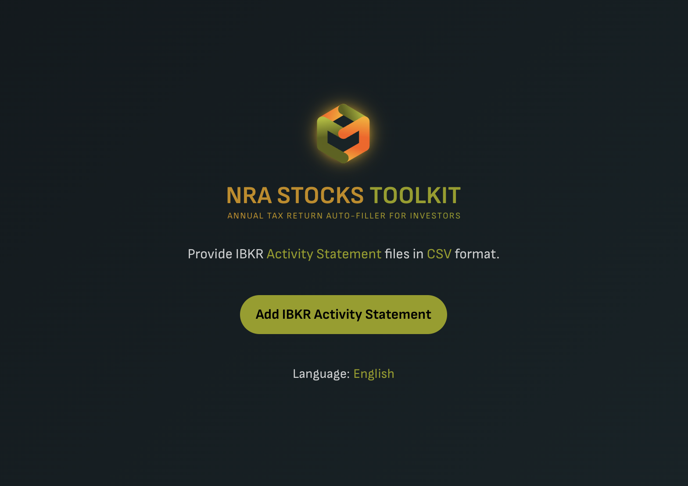
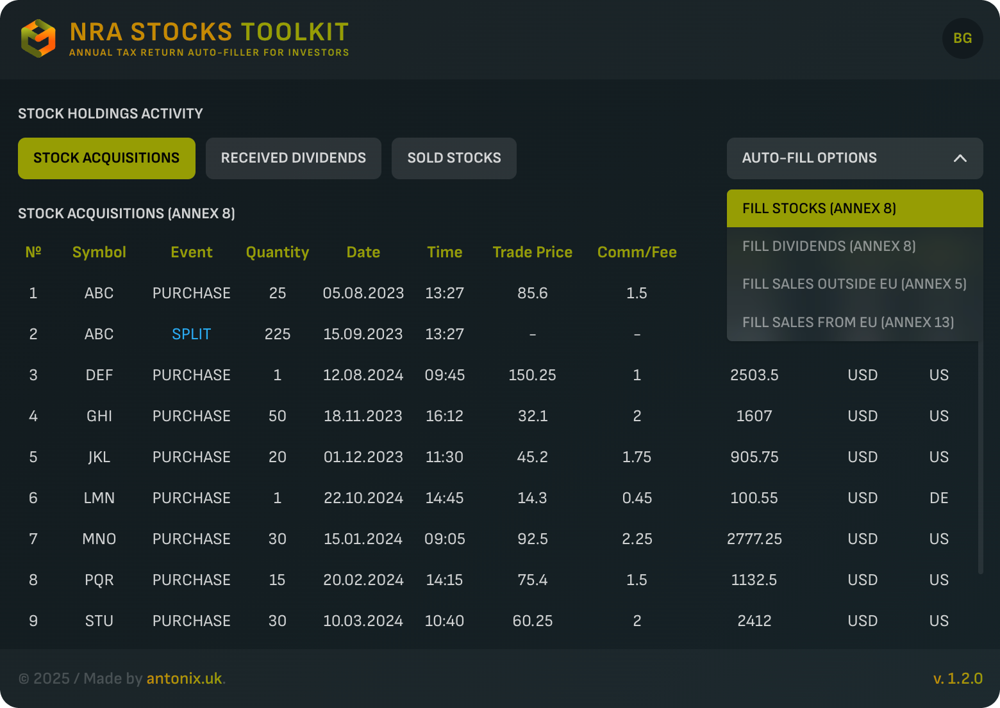

# NRA Stocks Toolkit - Annual Tax Return (ATR) Auto-Filler for Bulgarian investors

**За версия на този документ на български език, кликни [тук](README-BG.md).**

>**Make sure you always use the latest version, which is currently v. 1.5.1.**

The purpose of this browser extension is to simplify annual tax reporting for stock holdings on the National Revenue Agency (NRA) portal in Bulgaria (https://portal.nra.bg). It helps users save time by pre-filling forms and making interactions with the portal faster and more efficient.

For a quick demonstration, check out the video: [here](https://youtu.be/JjMxRMxLQno) (to be updated).

> **Note: The screenshots display fake, auto-generated statement details, used solely to showcase the interface.**

## Features
- Auto-fills Annex 8, Part I: Reports stocks and company shares held abroad as of December 31 of the tax year (stocks only).
-	Auto-fills Annex 8, Part III: Determines the final tax due under Article 38 of the Personal Income Tax Act (PITA) for income from foreign sources of resident individuals.
-	Auto-fills Annex 5, Part I, Table II: Taxable income from the sale or exchange of shares.
-	Auto-fills Annex 13, Part II, Code 508: Sold stocks withn EU.

## Supported stock trading platforms and activities
  ### Interactive Brokers (IBKR) – Requires a CSV-format activity statement.
  Supported activities:
  - Purchase
  - Sale
  - Stock split (Note: reverse splits are not supported)

  Currently, certain corporate actions such as spin-offs and reverse splits are not supported.

> If you'd like me to add support for other popular stock trading platforms, feel free to email me at [antonix.uk@gmail.com](mailto:antonix.uk@gmail.com) or start a [discussion](https://github.com/antonfuchedzhiev/nra-stocks-toolkit/discussions) on GitHub. To make this possible, I'd need an example report from the platform - ideally in CSV format, with no personal information and preferably using fake data. Alternatively, you can write your own adapter or converter to match the IBKR Activity Statement data structure using the provided test report: [FAKE_U921264901_2023_2024.csv](resources/FAKE_U921264901_2023_2024.csv).

## Languages supported
- English
- Bulgarian

## Supported browsers
- Google Chrome
- Microsoft Edge
- Brave

## How to add extension to your browser
Download the unpacked extension as a ZIP file from [here](https://github.com/antonfuchedzhiev/nra-stocks-toolkit/archive/refs/heads/main.zip), or clone the repository using your preferred Git client.

1. In the address bar, type "chrome://extensions" and press Enter to open the "My extensions" page.
- Google Chrome - open "chrome://extensions"
- Microsoft Edge - open edge://extensions
- Brave - open "brave://extensions"
2. Enable "Developer mode" using the toggle in the top-right corner. Three new buttons will appear.
3. Click "Load unpacked", then select the folder where you downloaded the extension.
4. "NRA Stocks Toolkit" will now appear in your extensions list.
5. To access it easily, pin the extension to your browser's toolbar.

## How to use

For a quick demonstration, check out the video [here](https://youtu.be/JjMxRMxLQno).

### Download IBKR statements
  1. Log in to your IBKR account and navigate to "Performance & Reports" > "Statements".
  2. Select your preferred account, then from "Default Statements" choose "Activity".
  3. Set "Period" to "Annual" and choose the earliest year from the list. Keep "Language" set to English.
  4. In "Select a Format/Action" download the CSV file.
  5. Repeat for each account and year you're reporting taxes for.

### Add files to NRA Stocks Toolkit
  1. Open the NRA portal (https://portal.nra.bg) and navigate to:
  - Annex 8 for stock acquisitions and received dividends
  - Annex 5 for sold stocks outside EU
  - Annex 13 for sold stocks withn EU
  2. Open the "NRA Stocks Toolkit" extension from your browser's extensions list.
  3. Click "Add IBKR Activity Statement" and select all the downloaded CSV files.

### Review and fill in stock acquisitions
  1. "Stock Acquisitions" table will appear, summarizing the acquisitions. **Sales are deducted using the FIFO (First In, First Out) method (and are not displayed). Therefore, a complete trade order history up to the taxation year is required for maximum accuracy of calculations.**
  2. Select "Stocks (Annex 8)" option from "Auto-fill" menu to auto-fill the NRA Annex 8, Part I form. Exchange rates are retrieved from the NRA portal's official service.
  3. Once completed, verify the data before submitting the form.

### Review and fill in dividends
  1. Switch to the "Received Dividends" table to review the details. You can filter by year to match your tax reporting period.
  2. Select "Dividends (Annex 8)" option from "Auto-fill" menu to auto-fill the NRA Annex 8, Part III form. Exchange rates are retrieved from the NRA portal's official service based on the dividend pay date.
  3. Once completed, verify the data before submitting the form.

### Review and fill in sales from Non-EU stock exchanges
  1. Switch to the "Sold Stocks" table. You can filter by year to match the tax period, then review the details.
  2. Select "Sales Outside EU (Annex 5)" option from "Auto-fill" menu to auto-fill the NRA Annex 5, Part I, Table II form. Exchange rates are retrieved from the NRA portal's official service based on the sale date.
  4. Once completed, verify the data before submitting the form.

### Review and fill in sales within EU stock exchanges
  1. If you see lines highlighted in blue in the "Sold Stocks" table, it means you need to enter them into Annex 13 and navigate to that section on the NRA portal website.
  2. Select "Sales Within EU (Annex 13)" option from "Auto-fill" menu to auto-fill the NRA Annex 13, Part II, Code 508. Exchange rates are retrieved from the NRA portal's official service based on the sale date.
  4. Once completed, verify the data before submitting the form.

## Official distribution and privacy notice
  - Your data stays private. This extension does not collect, store, or share personal data - everything is processed locally on your device.
  - The only external request made is to NRA's exchange rate service, and it only shares the event date to fetch exchange rates for currency conversion. No other data is transmitted.
  - Official source: This extension is only available through the following github repository - [https://github.com/antonfuchedzhiev/nra-stocks-toolkit](https://github.com/antonfuchedzhiev/nra-stocks-toolkit). Any other sources may pose security risks, including malware, data theft, or compromised functionality.

## Issues and discussions
🛠️ Issues: [https://github.com/antonfuchedzhiev/nra-stocks-toolkit/issues](https://github.com/antonfuchedzhiev/nra-stocks-toolkit/issues)

💬 Discussions: [https://github.com/antonfuchedzhiev/nra-stocks-toolkit/discussions](https://github.com/antonfuchedzhiev/nra-stocks-toolkit/discussions)

## NRA Portal resources (March 27, 2024)

### List of agreements
Countries with which Bulgaria has a Double Taxation Avoidance Agreement (DTAA) -
https://nra.bg/wps/portal/nra/mezhdunarodni-deinosti/siddo/spisak-sas-spogodbi

### Methods for avoiding double taxation
Methods for relieving double taxation on profits and income earned by Bulgarian tax residents abroad, in accordance with the Double Taxation Avoidance Agreements (DTAA) - https://nra.bg/wps/portal/nra/documents/hiddenfloder1/3fd47b64-2f87-4ee4-8cba-ed43be5ffd6b

## Changelog
Click [here](CHANGELOG.md) to view the latest updates and changes.
